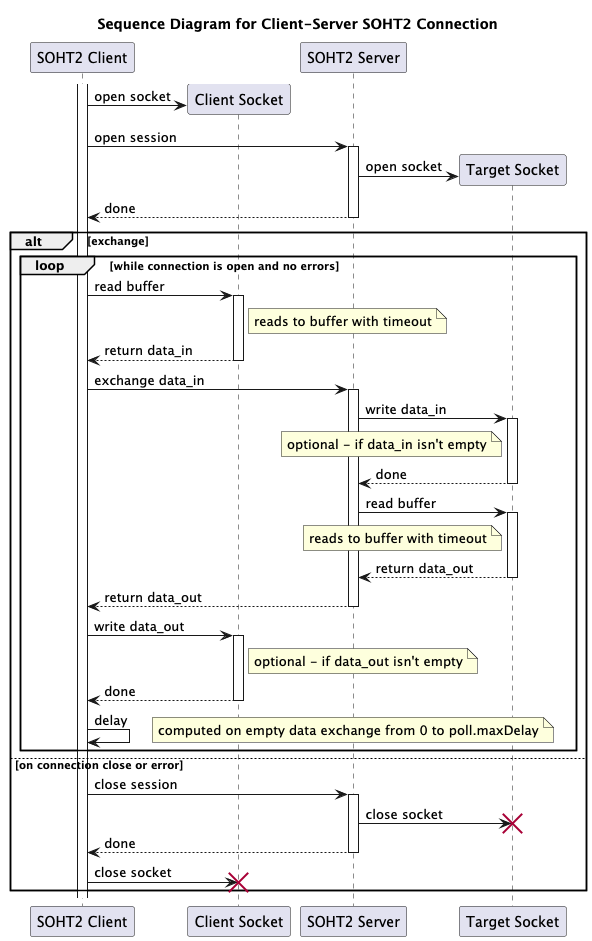

SOHT2 - Socket Over HTTP Tunnel 2
=================================

[](https://openjdk.org "OpenJDK homepage")
[](https://spring.io/projects/spring-boot "Spring Boot homepage")
[](https://typescriptlang.org "TypeScript homepage")
[](https://reactjs.org "React homepage")
[](https://nodejs.org/en "Node.js homepage")<br>
[](https://opensource.org/licenses/MIT "MIT License page")
[](https://github.com/domax/soht2/actions/workflows/github-code-scanning/codeql)
[](https://github.com/domax/soht2/actions/workflows/gradle-publish.yml)
[](https://github.com/domax?tab=packages&repo_name=soht2 "SOHT2 Packages page")

SOHT2 is a Java-based API that provides a secure and efficient way to tunnel socket connections over
HTTP. It is designed to work seamlessly with various applications that require socket communication,
such as web services, IoT devices, and more.

This project was inspired by the [original SOHT project](https://www.ericdaugherty.com/dev/soht/)
but has been rewritten using modern Java to improve performance, reliability, and maintainability.

SOHT2 leverages modern Java features and best practices to deliver a robust and flexible solution
for socket tunneling needs. It is built with a focus on simplicity and ease of use, making it
accessible for users of all skill levels.

It supports both client and server modes, allowing you to create a tunnel for outgoing connections
or to accept incoming connections through an optional HTTP proxy.

Disclaimer
----------

This project is not affiliated with or endorsed by the original SOHT project or its authors. It is
an independent implementation that aims to provide similar functionality with modern Java practices.

Also, this project is not a legal advice or a security solution. It is provided "as is" without any
warranties or guarantees. Use it at your own risk.

Please review the code and documentation carefully before using it in production environments.
For any legal or security concerns, consult with a qualified professional.

This project is intended for educational and informational purposes only.

By using this project, you agree to the terms of the [MIT License](LICENSE.txt) and then merge it
into the site-policy repo. This is to ensure that I can review and iterate on the changes before
they are made public. I appreciate your understanding and cooperation in this process.

How It Works
------------

SOHT2 establishes a tunnel between a client and a server over HTTP. The client sends socket
connection requests to the server, which then forwards these requests to the appropriate remote
hosts. The server acts as a bridge, allowing the client to communicate with remote hosts without
exposing them directly to the client.


Below is a simplified sequence diagram illustrating the flow of a connection request from the client
to the server and how the server processes this request to establish a tunnel to a remote host:



How to Configure And Run
------------------------

Both the client and server components can be run using Java, so on both sides you need to have Java
21 or later installed.

### Server Part

1. Get the latest release, e.g. `soht2-server-X.X.X.jar`
   from [packages](https://github.com/domax/soht2/packages).
2. Create/Edit the `application-server.yaml` file to configure the server settings, and
   place it in the same directory as the JAR file. Here is an example configuration:
    ```yaml
    soht2.server:
      socket-read-timeout: PT0.1S                  # Timeout for socket read operations
      read-buffer-size: 1MB                        # Size of the read buffer for socket connections
      user-cache-ttl: PT10M                        # Time-to-live for user cache entries
      database-path: ./soht2                       # Path to the database file
      admin-username: "${SOHT2_USR}"               # Username for the admin user
      default-admin-password: "${SOHT2_PWD}"       # Default password for the admin user
      open-api-server-url: https://${SOHT2_SERVER} # Public URL of the OpenAPI server
      enable-history: true                         # Enable gathering connection history
      abandoned-connections:                       # Settings for abandoned connections
        timeout: PT1M                              # Timeout for abandoned connections
        check-interval: PT5S                       # Interval for checking abandoned connections
    ```
   All settings are optional, but you have to define `soht2.server.database-path`,
   `soht2.server.admin-username`, and `soht2.server.default-admin-password` to create database and
   admin user for the server.
3. Run the server with the following command:
    ```shell
    java -jar soht2-server-X.X.X.jar
    ```
   __IMPORTANT! Change your admin's password via UI or REST API right after the server starts.__

### Client Part

1. Get the latest release, e.g. `soht2-client-X.X.X.jar`
   from [packages](https://github.com/domax/soht2/packages).
2. Create/Edit the `application-client.yaml` file to configure the client settings, and
   place it in the same directory as the JAR file. Here is an example configuration:
    ```yaml
    soht2.client:
      url: https://${SOHT2_SERVER}/api/connection # URL of the SOHT2 server API endpoint
      socket-read-timeout: PT0.1S     # Timeout for reading from socket connections
      read-buffer-size: 1MB           # Size of the read buffer for socket connections
      username: "${SOHT2_USR}"        # Username for authentication on SOHT2 server
      password: "${SOHT2_PWD}"        # Password for authentication on SOHT2 server
      connections:                    # List of connections to establish - at least 1 item required
        - local-port: 2022            # Local port to listen on
          remote-host: ${REMOTE_HOST} # Remote host to connect to
          remote-port: 22             # Port on a remote host to connect to
      compression:                    # Compression settings for the connections
        type: none                    # Compression type for the connections (none, gzip, deflate)
        min-request-size: 2KB         # Minimum request size to apply compression
      poll:                           # Polling settings for the connections
        strategy: exponent            # Polling strategy for connections (exponent, linear, fixed)
        initial-delay: PT0.1S         # Initial delay before the first poll retry
        max-delay: PT1S               # Maximum delay between retries
        factor: 5                     # Factor for exponential backoff
      proxy:                          # HTTP or NTLM proxy configuration
        host: ${PROXY_HOST}           # If defined, the client sets up an HTTP proxy to this host
        port: ${PROXY_PORT}           # Port of the HTTP proxy host
        username: "${PROXY_USR}"      # Optional, only for authenticated HTTP or NTLM proxy
        password: "${PROXY_PWD}"      # Optional, only for authenticated HTTP or NTLM proxy
        domain: "MYORG"               # Optional, only for NTLM proxy
      disable-ssl-verification: false # Disable SSL verification for the connections
    ```
   You have to define `soht2.client.url` and at least one connection in the
   `soht2.client.connections` list. All the rest of properties are optional.<br>
   If you want to use an HTTP proxy, you can define the `soht2.client.proxy` section with
   appropriate values.<br>
   If you want to use SOCKS5 proxy, just add `-DsocksProxyHost=localhost -DsocksProxyPort=1080` to
   the list of JVM options (see next step) - but set the correct host and port, of course.<br>
   _Be aware that this implementation does not support authentication for SOCKS5 proxy._
3. Run the client with the following command:
    ```shell
    java -jar soht2-client-X.X.X.jar
    ```
   Or, with SOCKS5 proxy:
    ```shell
    java -DsocksProxyHost=localhost -DsocksProxyPort=1080 -jar soht2-client-X.X.X.jar
    ```
4. If you don't have errors, you should be able to connect to the remote host through the tunnel.
   You can test it by running `telnet localhost 2022` (or whatever local port you defined in the
   configuration) and then trying to connect to the remote host, e.g. `ssh -p 2022 user@localhost`
   for this example configuration.

Tips & Tricks
-------------

* [SOHT2 Server](doc/tips-server.md)
* [SOHT2 Client](doc/tips-client.md)

TODO List
---------

- [X] Implement support for client side compression
- [X] Add proxy support for the client side
- [X] Add removal of abandoned connections on the server side
- [X] Update sequence diagram
- [X] Update README.md with more details
- [X] Finalize authentication and authorization mechanisms
- [X] Add user controller for managing users
- [X] Add OpenAPI documentation for the server API
- [X] Add allowedTargets per user on the server side (`*:*`, `localhost:*`, `192.168.0.*:22`, etc.)
- [X] Add username and password validation
- [X] Add connection history on the server side
- [ ] Implement UI
- [ ] Add gathering transferred data size
- [ ] Add more tests
- [ ] Fix NTLM proxy
- [ ] Add Kerberos proxy support
